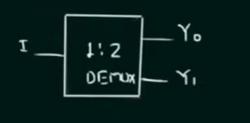

## 1:2 Demultiplexer | Verilog

A **Verilog implementation of a 1:2 demultiplexer (DEMUX)**, designed and simulated in **Xilinx Vivado**.  
This document explains:

- **What a demultiplexer is**
- **How a 1→2 DEMUX works**
- The **truth table**, **Boolean equations**, and **signal assignments**
- How to **run the design and testbench in Vivado**

The project includes the **RTL design**, **testbench**, **simulation waveform**, and **console-style output** verifying correct behavior.

---

## Table of Contents

- [What Is a Demultiplexer?](#what-is-a-demultiplexer)
- [1:2 Demultiplexer Basics](#12-demultiplexer-basics)
- [Truth Table and Boolean Equations](#truth-table-and-boolean-equations)
- [Circuit Description](#circuit-description)
- [Waveform Diagram](#waveform-diagram)
- [Testbench Output](#testbench-output)
- [Running the Project in Vivado](#running-the-project-in-vivado)
- [Project Files](#project-files)

---

## What Is a Demultiplexer?

A **demultiplexer (DEMUX)** is a combinational logic circuit that routes **a single input** to **one of many outputs** based on the value of **select lines**.  
It is conceptually the **reverse of a multiplexer**:

- A **multiplexer (MUX)** selects **one of many inputs** and forwards it to a **single output**.  
- A **demultiplexer (DEMUX)** takes **one input** and sends it to **exactly one of several outputs** at a time.

DEMUXes are commonly used in:

- **Data routing** and **signal distribution**
- **Memory addressing** and **chip-select logic**
- **Time-division multiplexing/demultiplexing**

---

## 1:2 Demultiplexer Basics

This project implements a **1:2 demultiplexer with enable**. The signals are:

- **I** – data input  
- **E** – enable input  
- **S₀** – select line  
- **Y₀, Y₁** – outputs

Behavior:

- When **E = 0**, the DEMUX is **disabled** and both outputs are **0**, regardless of `I` and `S₀`.
- When **E = 1**, the DEMUX is **enabled** and the single input `I` is routed to **exactly one** of the outputs:
  - If **S₀ = 0**, then `Y₀ = I` and `Y₁ = 0`.
  - If **S₀ = 1**, then `Y₀ = 0` and `Y₁ = I`.

---

## Truth Table and Boolean Equations

Using inputs **E**, **S₀**, and **I**, and outputs **Y₀**, **Y₁**, the complete truth table is:

| E | S₀ | I | Y₀ | Y₁ |
|---|----|---|----|----|
| 0 | 0  | 0 | 0  | 0  |
| 0 | 0  | 1 | 0  | 0  |
| 0 | 1  | 0 | 0  | 0  |
| 0 | 1  | 1 | 0  | 0  |
| 1 | 0  | 0 | 0  | 0  |
| 1 | 0  | 1 | 1  | 0  |
| 1 | 1  | 0 | 0  | 0  |
| 1 | 1  | 1 | 0  | 1  |

From this table, we can derive the Boolean equations for the outputs:

\[
$$Y_0 = E \cdot I \cdot \overline{S_0}$$
\]
\[
$$Y_1 = E \cdot I \cdot S_0$$
\]

In more programming-style notation:

```text
Y0 = E & I & ~S0
Y1 = E & I &  S0
```

These equations capture the key DEMUX behavior:

- The **enable** `E` must be 1 for any output to be active.
- Exactly **one** of `Y0` or `Y1` can be equal to `I` at a time, based on `S0`.

---

## Circuit Description

The 1:2 DEMUX circuit uses basic logic gates to realize the Boolean expressions above:

- **AND gate** for `Y0`:
  - Inputs: `E`, `I`, and `~S0`
  - Output: `Y0`
- **AND gate** for `Y1`:
  - Inputs: `E`, `I`, and `S0`
  - Output: `Y1`
- **NOT gate** to generate `~S0` (the complement of the select line)

Conceptual view:

```text
          E -----+-------+ 
                AND     AND
          I -----| \     | \ 
                |  &----|  &---- Y1
        S0 -----| /     | /
                 ^       ^
                 |       |
                ~S0     S0

        ~S0 generated by an inverter from S0

Y0 = E · I · ~S0
Y1 = E · I · S0
```

In the Verilog implementation, these relationships are encoded directly using combinational logic assignments.

---


## Waveform Diagram

The behavioral simulation verifies operation by:

1. Sweeping through **all 8 combinations** of inputs `(E, S0, I)`.  
2. Observing that the outputs `Y0` and `Y1` match the DEMUX truth table for each case.

Signals observed:

```text
Inputs :
  E, S0, I
Outputs:
  Y0, Y1
```

---

## Testbench Output

A conceptual console-style view of the testbench results (matching the truth table) is:

```text
E S0 I | Y0 Y1
----------------
0 0 0 | 0 0
0 0 1 | 0 0
0 1 0 | 0 0
0 1 1 | 0 0
1 0 0 | 0 0
1 0 1 | 1 0
1 1 0 | 0 0
1 1 1 | 0 1
```

These results confirm that **Y0** and **Y1** follow the expected 1:2 demultiplexer behavior with enable.

---

## Running the Project in Vivado

### 1. Launch Vivado

Open **Xilinx Vivado**.

### 2. Create a New RTL Project

- **Create Project**  
- Choose **RTL Project**  
- Enable **Do not specify sources at this time** (optional) or add them directly.

### 3. Add Design and Simulation Files

Design Sources (RTL):

```text
oneTwoDemux.v
```

Simulation Sources (Testbench):

```text
oneTwoDemux_tb.v
```

Set `oneTwoDemux_tb.v` as the **simulation top module**.

### 4. Run Behavioral Simulation

In Vivado:

```text
Flow -> Run Simulation -> Run Behavioral Simulation
```

Observe the signals:

```text
Inputs : E, S0, I
Outputs: Y0, Y1
```

Verify from the waveform that the outputs follow the **truth table** and match the console-style output listed above.

---

## Project Files

| File              | Description                                             |
|-------------------|---------------------------------------------------------|
| `oneTwoDemux.v`   | RTL implementation of the 1:2 demultiplexer with enable |
| `oneTwoDemux_tb.v`| Testbench that stimulates the DEMUX and records waveforms |

---

**Author**: **Kadhir Ponnambalam**
